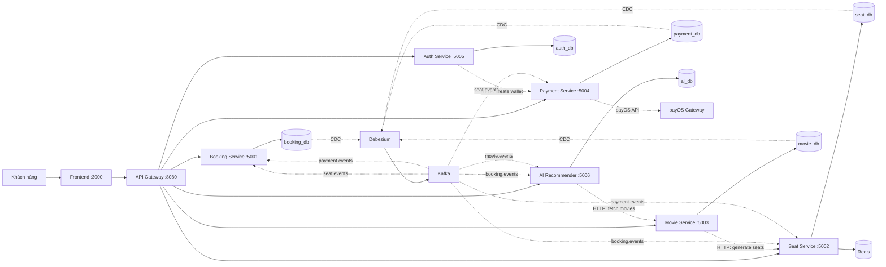
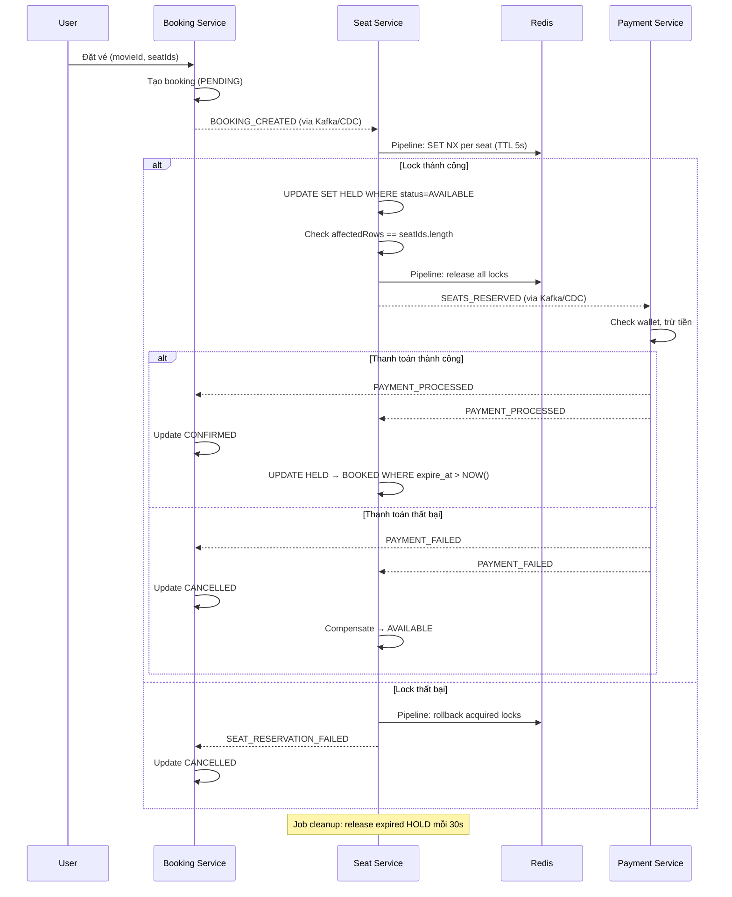
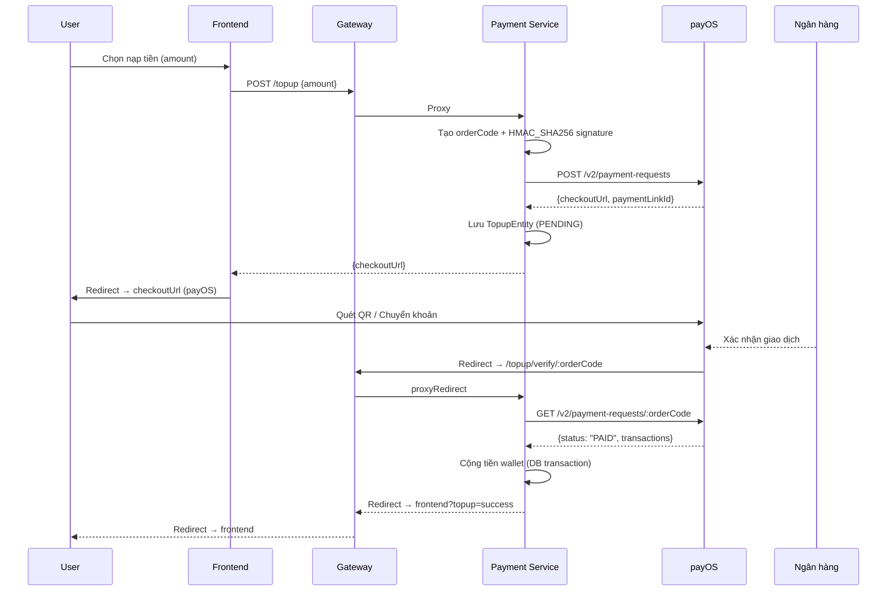

# Hệ thống Đặt vé Xem phim (Movie Ticket Booking System)

> Hệ thống đặt vé xem phim dựa trên kiến trúc microservices, triển khai **Saga Choreography**, **Kafka** giao tiếp hướng sự kiện, **Debezium CDC + Outbox Pattern** phát sự kiện đáng tin cậy, **Redis Distributed Locking** chống race condition khi giữ ghế, và **payOS Payment Gateway** nạp tiền ví qua chuyển khoản ngân hàng.

## Kiến trúc tổng quan



## Thành phần hệ thống

| Thành phần | Trách nhiệm | Công nghệ | Cổng |
|-----------|-------------|------------|------|
| **Frontend** | Giao diện duyệt phim, đặt vé, xem gợi ý AI | React + Vite | 3000 |
| **Gateway** | Định tuyến API, Aggregated Health Check | NestJS | 8080 |
| **Booking Service** | Vòng đời đặt vé, khởi tạo saga | NestJS + TypeORM + Kafka | 5001 |
| **Seat Service** | Quản lý ghế, Redis Distributed Locking, Hold Timeout | NestJS + TypeORM + Kafka + Redis | 5002 |
| **Movie Service** | Danh mục phim, quản lý suất chiếu, Admin CRUD | NestJS + TypeORM | 5003 |
| **Payment Service** | Xử lý thanh toán (ví điện tử), nạp tiền qua payOS, tạo ví tự động | NestJS + TypeORM + Kafka + JWT + payOS | 5004 |
| **Auth Service** | Xác thực JWT, đăng nhập/đăng ký, tự động tạo ví | NestJS + TypeORM + JWT + bcrypt | 5005 |
| **AI Recommender** | Gợi ý phim AI (Cosine + Jaccard + Bonus Tiers) | NestJS + TypeORM + Kafka + Transformers | 5006 |
| **Kafka** | Hàng đợi tin nhắn hướng sự kiện | Apache Kafka (KRaft) | 9092 |
| **Debezium** | CDC — bắt thay đổi outbox đẩy vào Kafka | Debezium Connect | 8083 |
| **Redis** | Distributed Locking cho seat reservation | Redis 7 Alpine | 6379 |
| **MySQL** | Cơ sở dữ liệu (Database per Service — 6 DB) | MySQL 8 | 3306 |

## Luồng đặt vé (Saga Flow + Redis Lock)



## Các mô hình kiến trúc

| Mô hình | Mục đích |
|---------|----------|
| **Saga (Choreography)** | Giao dịch phân tán qua Kafka events, không cần orchestrator |
| **Outbox Pattern** | Ghi event + dữ liệu nghiệp vụ trong cùng DB transaction |
| **CDC (Debezium)** | Phát event đáng tin cậy từ outbox vào Kafka qua MySQL binlog |
| **Redis Distributed Locking** | Chống race condition khi giữ ghế, giảm tải DB lock |
| **Seat Hold + Timeout** | Ghế giữ tạm 5 phút, job tự động giải phóng ghế hết hạn |
| **Database per Service** | 6 database riêng biệt, cô lập dữ liệu |
| **Idempotent Consumers** | Bảng processed_events ngăn xử lý event trùng lặp |
| **JWT + RBAC** | Xác thực stateless, phân quyền USER/ADMIN |
| **AI Recommendation** | Cosine Similarity 60% + Jaccard Similarity 40% + Bonus Tiers |
| **Aggregated Health Check** | Gateway kiểm tra health tất cả services cùng lúc |
| **payOS Payment Gateway** | Nạp tiền ví qua chuyển khoản ngân hàng / QR, HMAC_SHA256 signature |

## Luồng nạp tiền ví (payOS Top-up Flow)



## Khởi chạy

```bash
git clone <your-repo-url>
cd <project-folder>
npm install
npm run env:local

# Chạy infrastructure (MySQL, Kafka, Debezium, Redis)
docker compose up -d kafka debezium redis

# Chạy tất cả services
npm run start:dev

# Chạy frontend
cd frontend && npm run dev
```

### Health Check

```bash
# Kiểm tra từng service
curl http://localhost:8080/health

# Aggregated health check (tất cả services)
curl http://localhost:8080/health/all
```

## Tài liệu

| Document | Description |
|----------|-------------|
| [`GETTING_STARTED.md`](GETTING_STARTED.md) | Hướng dẫn cài đặt và workflow |
| [`docs/architecture.md`](docs/architecture.md) | Kiến trúc hệ thống chi tiết |
| [`docs/analysis-and-design-ddd.md`](docs/analysis-and-design-ddd.md) | Phân tích & Thiết kế DDD |
| [`docs/api-specs/`](docs/api-specs/) | OpenAPI 3.0 specifications |

## Cấu trúc thư mục

```
├── services/
│   ├── booking-service/     # Saga orchestration, đặt vé
│   ├── seat-service/        # Redis locking, giữ ghế, timeout
│   ├── movie-service/       # CRUD phim, tạo suất chiếu
│   ├── payment-service/     # Thanh toán ví + Nạp tiền payOS
│   │   └── src/
│   │       ├── entities/
│   │       │   ├── wallet.entity.ts   # Ví tài khoản
│   │       │   ├── payment.entity.ts  # Thanh toán booking
│   │       │   └── topup.entity.ts    # Nạp tiền payOS
│   │       ├── controllers/
│   │       │   ├── payment.controller.ts  # Wallet API
│   │       │   └── topup.controller.ts    # Top-up API
│   │       └── services/
│   │           ├── payment.service.ts     # Saga payment
│   │           └── topup.service.ts       # payOS integration
│   ├── auth-service/        # JWT authentication
│   └── ai-recommender-service/ # AI gợi ý phim
├── gateway/                 # API Gateway + Aggregated Health
├── libs/common/             # Shared: Outbox, Idempotency, Redis, JWT
├── frontend/                # React + Vite SPA
├── scripts/                 # SQL init + seed data
└── docker-compose.yml       # Full infrastructure
```