# Analysis and Design — Domain-Driven Design Approach

> **Cách tiếp cận được chọn**: Strategic DDD — phân tích theo sự kiện miền (domain events) và ngữ cảnh giới hạn (bounded contexts).
> Cách tiếp cận này phù hợp tự nhiên với kiến trúc microservice hướng sự kiện sử dụng Saga, Kafka và Debezium CDC.

## Part 1 — Domain Discovery

### 1.1 Business Process Definition

Mô tả quy trình nghiệp vụ cấp cao cần được tự động hóa.

- **Domain**: Rạp chiếu phim
- **Business Process**: Đặt vé xem phim — Luồng xử lý từ khi khách hàng chọn phim đến khi nhận được vé đã xác nhận
- **Actors**:
  - **Khách hàng** — Duyệt phim, chọn suất chiếu và ghế, khởi tạo đặt vé, thanh toán
  - **Hệ thống (Điều phối Saga)** — Phối hợp giao dịch phân tán giữa các dịch vụ
  - **Quản trị viên** (ngoài phạm vi MVP) — Quản lý phim, suất chiếu và cấu hình ghế ngồi
- **Scope**: Tập trung vào **một quy trình nghiệp vụ duy nhất** — **đặt vé xem phim** — bao gồm giữ ghế, xử lý thanh toán và xác nhận vé. Đây là một giao dịch phân tán qua nhiều dịch vụ, được điều phối bởi mô hình Saga.

**Process Diagram:**

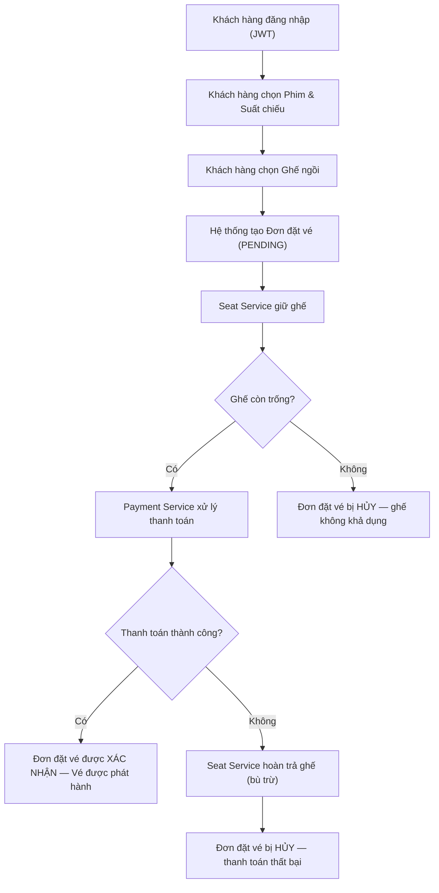

### 1.2 Existing Automation Systems

| System Name | Type | Current Role | Interaction Method |
|-------------|------|--------------|-------------------|
| *Không có* | — | — | — |

> *"Không có — quy trình hiện tại được thực hiện thủ công / đây là hệ thống xây dựng mới hoàn toàn (greenfield)."*

### 1.3 Non-Functional Requirements

| Requirement    | Description |
|----------------|-------------|
| Performance    | Việc giữ ghế phải phản hồi trong vòng 2 giây. Hệ thống phải xử lý tốt các yêu cầu đặt ghế đồng thời cho cùng một ghế. |
| Security       | Xác thực người dùng bằng JWT (JSON Web Token). Mật khẩu được hash bằng bcrypt. Tất cả API endpoint đặt vé yêu cầu Bearer token hợp lệ. userId được trích xuất từ JWT payload, không tin tưởng từ client. |
| Authentication | Đăng nhập bằng email + mật khẩu → nhận JWT token (hết hạn 24h). Đăng ký tài khoản mới với số dư khởi tạo. API `/auth/me` để kiểm tra phiên đăng nhập. |
| Scalability    | Mỗi dịch vụ phải có khả năng mở rộng độc lập. Kafka cho phép giao tiếp bất đồng bộ, tách rời giữa các dịch vụ và mở rộng theo chiều ngang. |
| Availability   | Nếu một dịch vụ tạm thời ngừng hoạt động, tin nhắn được giữ lại trong Kafka và xử lý khi dịch vụ khôi phục. Chấp nhận tính nhất quán cuối cùng (eventual consistency). |
| Consistency    | Giao dịch phân tán được quản lý qua mô hình Saga. Logic bù trừ (compensation) đảm bảo tính đúng đắn dữ liệu trong trường hợp lỗi. |
| Idempotency    | Mọi consumer sự kiện phải có tính idempotent — việc gửi sự kiện trùng lặp (at-least-once) không được gây xử lý kép. |

---

## Part 2 — Strategic Domain-Driven Design

### 2.1 Ubiquitous Language

Thiết lập từ vựng miền thống nhất để tránh hiểu sai nghiệp vụ giữa các dịch vụ và giữa các thành viên nhóm.

| Term | Definition | Example |
|------|------------|---------|
| Booking | Đơn đặt vé của một người dùng cho một suất chiếu, gồm danh sách ghế và tổng tiền | Booking có trạng thái ban đầu là `PENDING` sau khi gọi `POST /bookings` |
| Showtime | Một suất chiếu cụ thể của một phim theo thời gian và phòng chiếu | `showtime-001` thuộc phim `movie-001` |
| Seat | Ghế theo từng suất chiếu, có vòng đời `AVAILABLE -> HELD -> BOOKED` | `seat-showtime-001-A1` |
| Payment | Giao dịch trừ số dư tài khoản người dùng để thanh toán booking | Payment có trạng thái `PROCESSED` hoặc `FAILED` |
| Saga | Cơ chế điều phối giao dịch phân tán theo chuỗi sự kiện giữa Booking, Seat, Payment | Chuỗi thành công: `BOOKING_CREATED -> SEATS_RESERVED -> PAYMENT_PROCESSED -> BOOKING_CONFIRMED` |
| Compensation | Hành động hoàn tác khi một bước saga thất bại để khôi phục tính nhất quán | `PAYMENT_FAILED` dẫn đến `SEATS_COMPENSATED` và `BOOKING_CANCELLED` |
| Outbox | Bảng lưu sự kiện miền trong cùng transaction với dữ liệu nghiệp vụ | Booking ghi `BOOKING_CREATED` vào outbox khi tạo đơn |
| Idempotency | Đảm bảo xử lý lặp lại cùng một sự kiện không gây thay đổi dữ liệu lần hai | Consumer kiểm tra bảng `processed_events` trước khi xử lý |
| Authenticated User | Người dùng đã đăng nhập, được nhận diện bằng JWT payload (`sub`) | `userId` lấy từ token, không lấy từ request body |

> Nguyên tắc áp dụng trong repo: cùng một thuật ngữ phải giữ nguyên nghĩa ở mọi bounded context. Ví dụ `Booking` luôn là vòng đời đơn đặt vé, không dùng để chỉ bản ghi thanh toán.

### 2.2 Event Storming — Domain Events

Liệt kê các Sự kiện miền (Domain Events) theo thứ tự thời gian xảy ra trong quy trình nghiệp vụ.
Định dạng: thì quá khứ (ví dụ: "OrderPlaced", "PaymentReceived").

| # | Domain Event | Triggered By | Description |
|---|-------------|--------------|-------------|
| 1 | `BookingCreated` | Khách hàng (qua API) | Đơn đặt vé mới được tạo với trạng thái PENDING. Chứa thông tin phim, suất chiếu, ghế. |
| 2 | `SeatsReserved` | Seat Service | Các ghế yêu cầu đã được đánh dấu là HELD (đang giữ) cho đơn đặt vé này. |
| 3 | `SeatReservationFailed` | Seat Service | Một hoặc nhiều ghế đã bị đặt trước hoặc không khả dụng. |
| 4 | `PaymentProcessed` | Payment Service | Thanh toán thành công. Số tiền đã được trừ. |
| 5 | `PaymentFailed` | Payment Service | Thanh toán bị từ chối hoặc thất bại. |
| 6 | `SeatsCompensated` | Seat Service | Các ghế đã giữ trước đó được hoàn trả (giải phóng) do lỗi ở bước tiếp theo (bù trừ). |
| 7 | `BookingConfirmed` | Booking Service | Đơn đặt vé được hoàn tất. Vé được phát hành. |
| 8 | `BookingCancelled` | Booking Service | Đơn đặt vé bị hủy do lỗi ở bất kỳ bước nào. |
| 9 | `MovieCreated` | Movie Service (Admin) | Phim mới được tạo bởi ADMIN và phát sự kiện `MOVIE_CREATED`. |

### 2.3 Commands and Actors

Lệnh nào kích hoạt các Sự kiện miền đó, và ai phát ra lệnh?

| Command | Actor | Triggers Event(s) | Description |
|---------|-------|-------------------|-------------|
| `CreateBooking` | Khách hàng (đã đăng nhập) | `BookingCreated` | Khởi tạo đơn đặt vé ở trạng thái `PENDING`; userId lấy từ JWT. |
| `AuthenticateUser` | Khách hàng | JWT Token (không phát Domain Event) | Gửi thông tin đăng nhập qua `/auth/login` để nhận access token. |
| `RegisterUser` | Khách hàng | JWT Token (không phát Domain Event) | Tạo tài khoản qua `/auth/register`, sau đó có thể đăng nhập để nhận token. |
| `ReserveSeats` | Seat Service (qua sự kiện) | `SeatsReserved` / `SeatReservationFailed` | Seat Service phản ứng với `BOOKING_CREATED`, khóa ghế bằng pessimistic locking và quyết định giữ ghế/thất bại. |
| `ProcessPayment` | Payment Service (qua sự kiện) | `PaymentProcessed` / `PaymentFailed` | Payment Service phản ứng với `SEATS_RESERVED`, kiểm tra số dư và xử lý thanh toán. |
| `CompensateSeats` | Seat Service (qua sự kiện) | `SeatsCompensated` | Seat Service phản ứng với `PAYMENT_FAILED`, giải phóng các ghế đã giữ. |
| `ConfirmBooking` | Booking Service (qua sự kiện) | `BookingConfirmed` | Booking Service phản ứng với `PAYMENT_PROCESSED`, xác nhận đơn thành công. |
| `CancelBooking` | Booking Service (qua sự kiện) | `BookingCancelled` | Booking Service hủy đơn khi nhận `SEAT_RESERVATION_FAILED` hoặc `SEATS_COMPENSATED`. |
| `CreateMovie` | Admin (qua API) | `MovieCreated` | Admin tạo phim mới qua `POST /movies` và phát sự kiện `MOVIE_CREATED`. |
| `CreateEmbedding` | AI Recommender (qua sự kiện) | — | AI Recommender phản ứng với `MOVIE_CREATED`, sinh embedding cho phim mới. |
| `RecordUserBehavior` | AI Recommender (qua sự kiện) | — | AI Recommender phản ứng với `BOOKING_CONFIRMED`, lưu lịch sử phim user đã đặt vé. |

### 2.4 Aggregates

Nhóm các Lệnh và Sự kiện liên quan xung quanh thực thể nghiệp vụ (Aggregate) mà chúng thao tác.

| Aggregate | Root Entity | Commands | Domain Events | Key Business Rules |
|-----------|-------------|----------|---------------|--------------------|
| **Booking (Đơn đặt vé)** | `Booking` | `CreateBooking`, `ConfirmBooking`, `CancelBooking` | `BookingCreated`, `BookingConfirmed`, `BookingCancelled` | `userId` bắt buộc lấy từ JWT; chỉ được chuyển sang `CONFIRMED` sau `PAYMENT_PROCESSED`; chuyển `CANCELLED` khi ghế không giữ được hoặc bù trừ xong. |
| **Seat (Ghế ngồi)** | `Seat` | `ReserveSeats`, `CompensateSeats` | `SeatsReserved`, `SeatReservationFailed`, `SeatsCompensated` | Mỗi ghế cho một showtime chỉ thuộc một booking tại một thời điểm; giữ ghế dùng `SELECT FOR UPDATE`; bù trừ phải trả ghế về `AVAILABLE`. |
| **Payment (Thanh toán)** | `Payment` | `ProcessPayment` | `PaymentProcessed`, `PaymentFailed` | Chỉ thanh toán khi đã nhận `SEATS_RESERVED`; chỉ trừ tiền nếu `balance >= totalAmount`; thất bại phải phát `PAYMENT_FAILED` kèm lý do. |
| **User (Người dùng)** | `User` | `AuthenticateUser`, `RegisterUser` | — | Email là duy nhất; mật khẩu lưu dạng bcrypt hash; JWT chứa `sub` để nhận diện user trong các API bảo vệ. |
| **Movie (Phim)** | `Movie` | `CreateMovie` | `MovieCreated` | Dữ liệu phim độc lập với saga; Admin tạo phim mới phát sự kiện `MOVIE_CREATED`. |
| **Showtime (Suất chiếu)** | `Showtime` | Truy vấn suất chiếu (read model) | — | Mỗi showtime gắn với một movie; giá vé và thời gian chiếu là nguồn dữ liệu tham chiếu cho luồng đặt vé. |
| **MovieEmbedding (Embedding mô tả phim)** | `MovieEmbedding` | `CreateEmbedding` | — | Vector 384 chiều từ all-MiniLM-L6-v2; mỗi phim có một embedding duy nhất; được sinh khi nhận `MOVIE_CREATED`. |
| **UserBehavior (Hành vi user)** | `UserBehavior` | `RecordUserBehavior` | — | Lưu lịch sử phim user đã đặt vé; mỗi cặp (userId, movieId) là duy nhất; được ghi khi nhận `BOOKING_CONFIRMED`. |

### 2.5 Bounded Contexts

Vẽ ranh giới xung quanh các Aggregate thuộc cùng một ngữ cảnh nghiệp vụ. Mỗi Bounded Context = một dịch vụ tiềm năng.

| Bounded Context | Aggregates | Responsibility |
|-----------------|------------|----------------|
| **Booking Context (Ngữ cảnh Đặt vé)** | Booking | Điều phối saga đặt vé. Quản lý vòng đời đơn đặt vé (tạo, xác nhận, hủy). Ghi sự kiện vào bảng outbox. |
| **Seat Context (Ngữ cảnh Ghế ngồi)** | Seat | Quản lý kho ghế theo từng suất chiếu. Giữ và giải phóng ghế. Xử lý đồng thời (khóa cấp dòng). Cung cấp REST API đọc trạng thái ghế. Ghi sự kiện vào outbox. |
| **Payment Context (Ngữ cảnh Thanh toán)** | Payment, Wallet | Xử lý thanh toán cho đơn đặt vé. Kiểm tra số dư ví (wallet). Cung cấp API xem số dư và tạo ví. Ghi sự kiện vào outbox. |
| **Auth Context (Ngữ cảnh Xác thực)** | User | Xác thực người dùng (JWT login/register/profile). Quản lý tài khoản. Không tham gia saga. |
| **Movie Context (Ngữ cảnh Phim)** | Movie, Showtime | Quản lý danh mục phim và lịch chiếu. Admin tạo phim mới (phát MOVIE_CREATED). Không tham gia saga. |
| **AI Recommender Context (Ngữ cảnh Gợi ý AI)** | MovieEmbedding, UserBehavior | Gợi ý phim dựa trên AI. Sử dụng semantic similarity (Cosine 60% + Jaccard 40% + bonus tiers) trên embeddings và thể loại. Tiêu thụ sự kiện MOVIE_CREATED và BOOKING_CONFIRMED từ Kafka. |

### 2.6 Context Map

Thể hiện mối quan hệ giữa các Bounded Context.

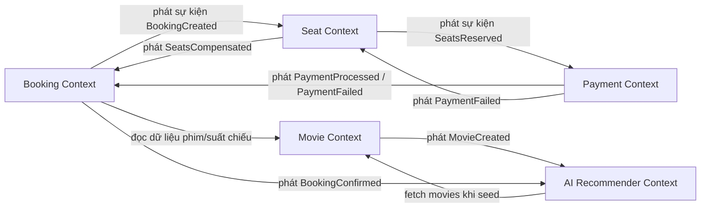

**Relationship types:** Upstream/Downstream, Customer/Supplier, Conformist, Anti-Corruption Layer (ACL), Shared Kernel, Open Host Service (OHS), Published Language.

| Upstream | Downstream | Relationship Type | Data Exchanged |
|----------|------------|-------------------|----------------|
| Booking Context | Seat Context | Customer/Supplier — Booking phát `BookingCreated`, Seat tiêu thụ và phản ứng | `bookingId`, `userId`, `showtimeId`, `seatIds[]`, `totalAmount` |
| Seat Context | Payment Context | Customer/Supplier — Seat phát `SeatsReserved`, Payment tiêu thụ và phản ứng | `bookingId`, `userId`, `showtimeId`, `seatIds[]`, `totalAmount` |
| Payment Context | Booking Context | Customer/Supplier — Payment phát sự kiện kết quả, Booking tiêu thụ để hoàn tất | Thành công: `bookingId`, `paymentId`, `amount`; Thất bại: `bookingId`, `reason` |
| Payment Context | Seat Context | Customer/Supplier — Payment phát `PaymentFailed`, Seat tiêu thụ để bù trừ | `bookingId`, `showtimeId`, `seatIds[]`, `reason` |
| Movie Context | Booking Context | Open Host Service (OHS) — Movie cung cấp REST API để tra cứu phim/suất chiếu | REST read model: `movieId`, `title`, `genre`, `duration`, `showtimeId`, `startTime`, `price` |
| Movie Context | AI Recommender Context | Customer/Supplier — Movie phát `MovieCreated`, AI Recommender sinh embedding | `movieId`, `title`, `genre`, `description` |
| Booking Context | AI Recommender Context | Customer/Supplier — Booking phát `BookingConfirmed`, AI Recommender lưu user behavior | `bookingId`, `userId`, `movieId` |
| AI Recommender Context | Movie Context | Conformist — AI Recommender fetch movies qua REST khi khởi động (seed embeddings) | REST read model: tất cả movies + embeddings |

### 2.7 Service Composition

Mô tả cách các bounded context phối hợp để hoàn thành quy trình đặt vé trong thực tế triển khai hiện tại.

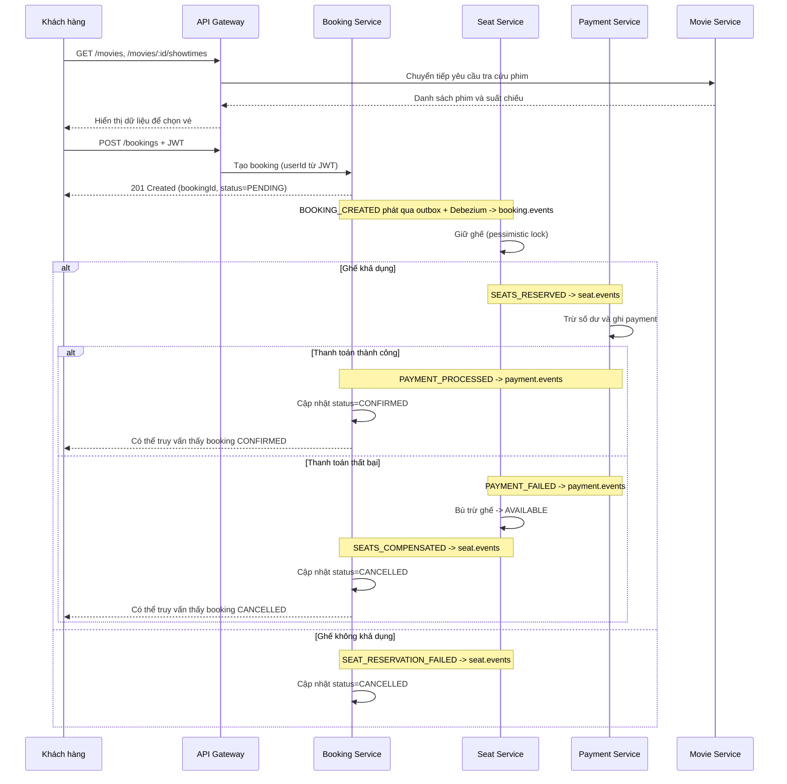

---

## Part 3 — Service-Oriented Design

### 3.1 Uniform Contract Design

Đặc tả Hợp đồng Dịch vụ cho mỗi Bounded Context / dịch vụ.

Full OpenAPI specs:
- [`docs/api-specs/booking-service.yaml`](api-specs/booking-service.yaml)
- [`docs/api-specs/movie-service.yaml`](api-specs/movie-service.yaml)
- [`docs/api-specs/seat-service.yaml`](api-specs/seat-service.yaml)
- [`docs/api-specs/payment-service.yaml`](api-specs/payment-service.yaml)
- [`docs/api-specs/auth-service.yaml`](api-specs/auth-service.yaml)
- [`docs/api-specs/ai-recommender-service.yaml`](api-specs/ai-recommender-service.yaml)

**Booking Service (Cổng 5001):**

| Endpoint | Method | Media Type | Response Codes | Mô tả |
|----------|--------|------------|----------------|--------|
| `/health` | GET | `application/json` | 200 | Kiểm tra sức khỏe dịch vụ |
| `/bookings` | POST | `application/json` | 201, 400, 500 | Tạo đơn đặt vé mới (khởi tạo saga) |
| `/bookings/:id` | GET | `application/json` | 200, 404 | Lấy thông tin đơn đặt vé theo ID |
| `/bookings` | GET | `application/json` | 200 | Danh sách đơn đặt vé của user hiện tại |

**Movie Service (Cổng 5003):**

| Endpoint | Method | Media Type | Response Codes | Mô tả |
|----------|--------|------------|----------------|--------|
| `/health` | GET | `application/json` | 200 | Kiểm tra sức khỏe dịch vụ |
| `/movies` | GET | `application/json` | 200 | Danh sách tất cả phim |
| `/movies` | POST | `application/json` | 201, 403 | Tạo phim mới (chỉ ADMIN). Phát sự kiện `MOVIE_CREATED` |
| `/movies/:id` | GET | `application/json` | 200, 404 | Lấy chi tiết phim |
| `/movies/:id/showtimes` | GET | `application/json` | 200, 404 | Lấy danh sách suất chiếu của phim |

**Seat Service (Cổng 5002) — REST API ghế + Kafka Consumer:**

| Endpoint | Method | Media Type | Response Codes | Mô tả |
|----------|--------|------------|----------------|--------|
| `/health` | GET | `application/json` | 200 | Kiểm tra sức khỏe dịch vụ |
| `/seats?showtimeId=xxx` | GET | `application/json` | 200 | Lấy danh sách ghế theo suất chiếu kèm trạng thái |

> Seat Service còn hoạt động theo hướng sự kiện. Nó tiêu thụ `booking.events` từ Kafka và phát đến `seat.events`. REST API `/seats` cung cấp trạng thái ghế cho frontend.

**Payment Service (Cổng 5004) — Kafka Consumer + REST API ví:**

| Endpoint | Method | Media Type | Response Codes | Mô tả |
|----------|--------|------------|----------------|--------|
| `/health` | GET | `application/json` | 200 | Kiểm tra sức khỏe dịch vụ |
| `/wallets/me` | GET | `application/json` | 200, 401 | Xem số dư ví của user hiện tại (JWT) |
| `/wallets` | POST | `application/json` | 201 | Tạo ví cho user mới (gọi nội bộ bởi Auth Service) |

> Payment Service tiêu thụ `seat.events` từ Kafka và phát đến `payment.events`. Số dư ví được quản lý qua bảng `wallets` trong `payment_db`.

**Auth Service (Cổng 5005) — Xác thực JWT:**

| Endpoint | Method | Media Type | Response Codes | Mô tả |
|----------|--------|------------|----------------|--------|
| `/health` | GET | `application/json` | 200 | Kiểm tra sức khỏe dịch vụ |
| `/auth/login` | POST | `application/json` | 201, 401 | Đăng nhập bằng email + mật khẩu → JWT |
| `/auth/register` | POST | `application/json` | 201, 409 | Đăng ký tài khoản mới |
| `/auth/me` | GET | `application/json` | 200, 401 | Lấy thông tin user từ JWT |

> Auth Service chỉ cung cấp REST API đồng bộ. Không tham gia saga.

**AI Recommender Service (Cổng 5006) — Kafka Consumer + REST API gợi ý:**

| Endpoint | Method | Media Type | Response Codes | Mô tả |
|----------|--------|------------|----------------|--------|
| `/health` | GET | `application/json` | 200 | Kiểm tra sức khỏe dịch vụ |
| `/recommendations/grouped` | GET | `application/json` | 200, 401 | Gợi ý phim theo sections (Top Picks + Per-Genre). Yêu cầu JWT |

> AI Recommender Service tiêu thụ `movie.events` (MOVIE_CREATED → sinh embedding) và `booking.events` (BOOKING_CONFIRMED → lưu user behavior). Sử dụng mô hình **all-MiniLM-L6-v2** (Sentence Transformers) để tạo semantic embeddings. Thuật toán: **60% Cosine Similarity + 40% Jaccard Similarity + bonus tiers**.

### 3.2 Service Logic Design

Luồng xử lý nội bộ của mỗi dịch vụ.

**Booking Service — Tạo đơn đặt vé:**

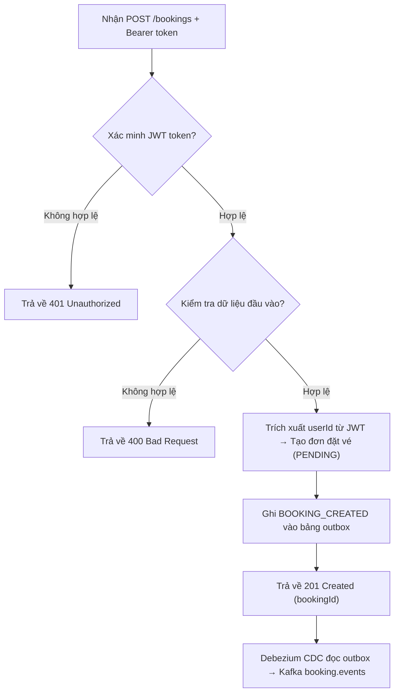

**Booking Service — Xử lý kết quả thanh toán (Kafka Consumer):**

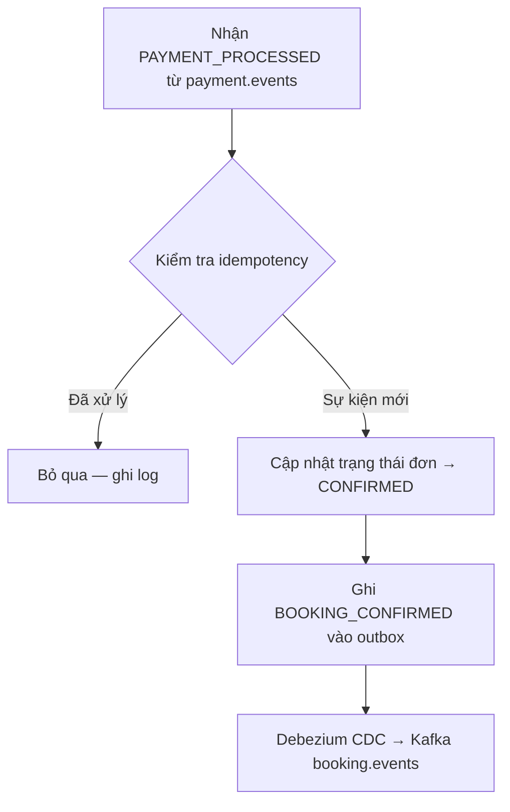

**Booking Service — Xử lý bù trừ (Kafka Consumer):**

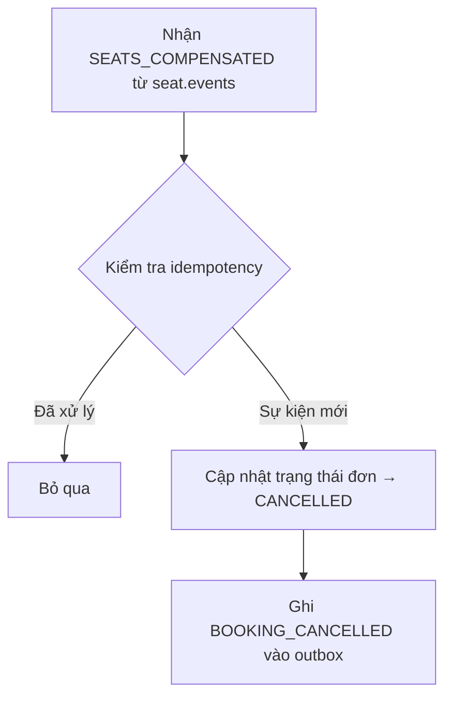

**Seat Service — Giữ ghế (Kafka Consumer):**

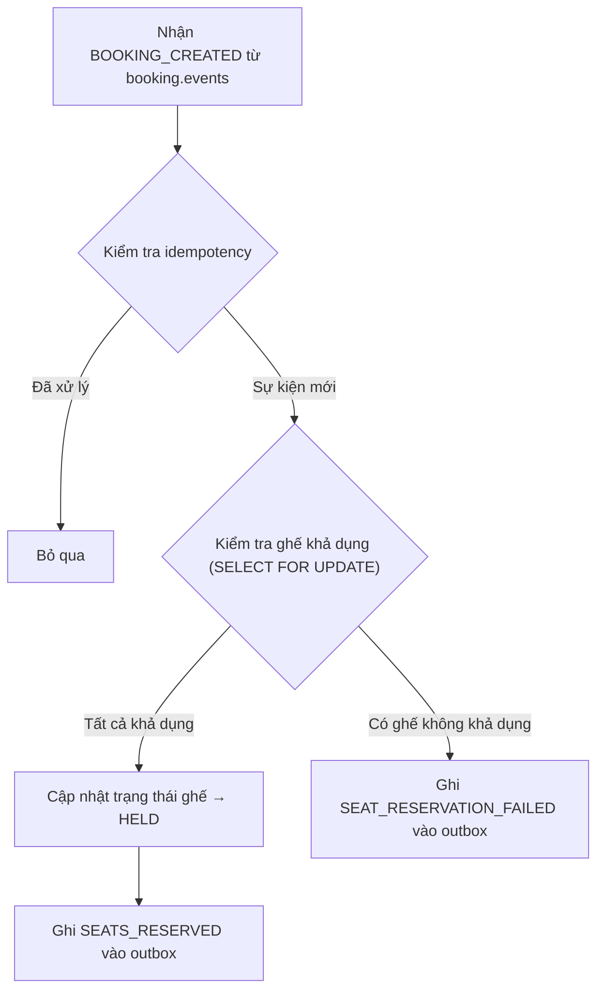

**Seat Service — Hoàn trả ghế / Bù trừ (Kafka Consumer):**

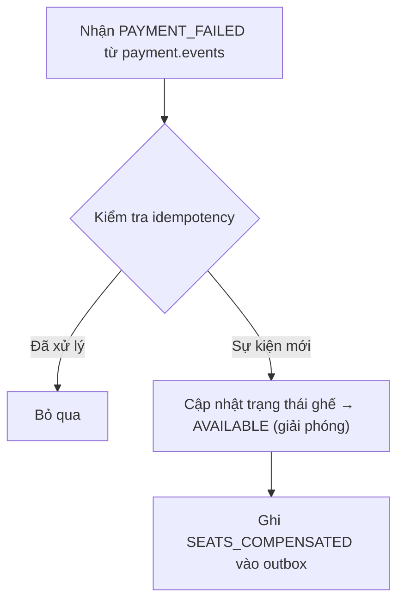

**Payment Service — Xử lý thanh toán (Kafka Consumer):**

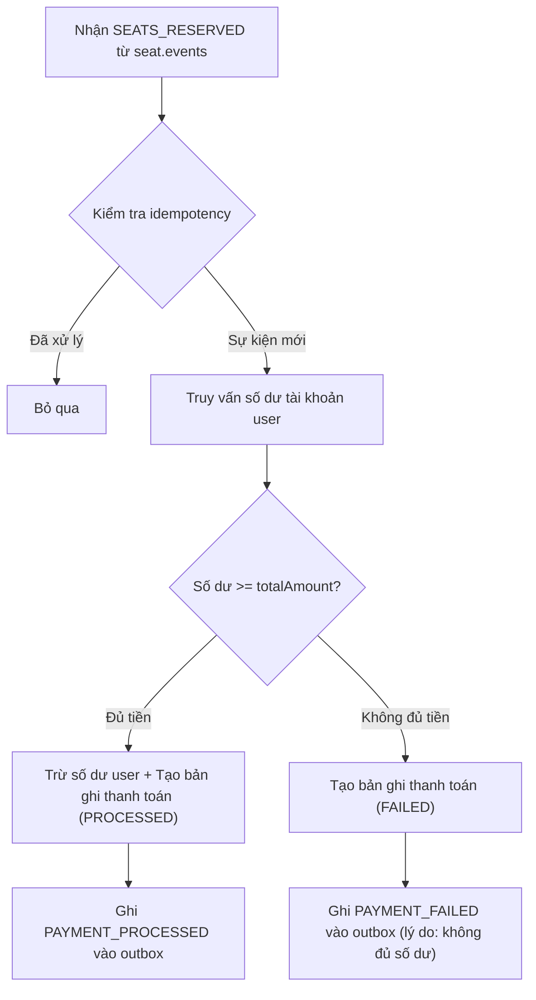

**Auth Service — Đăng nhập:**

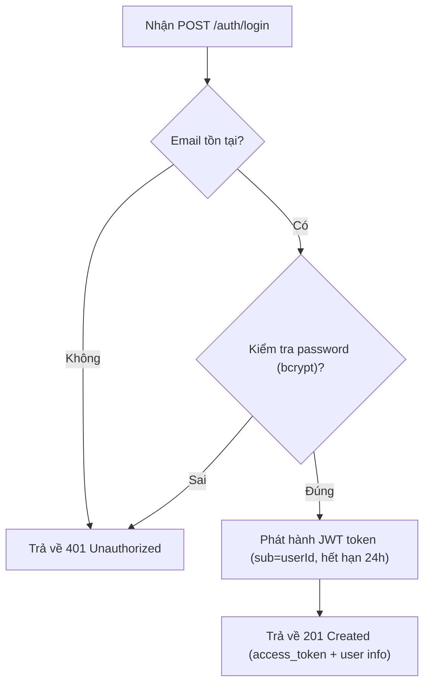

**Auth Service — Đăng ký:**

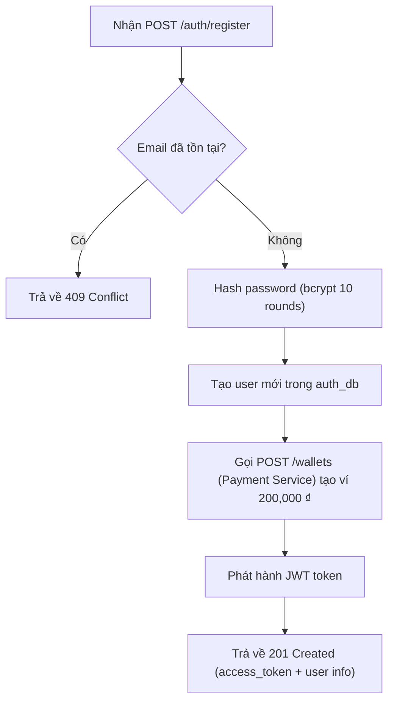

**AI Recommender Service — Sinh embedding (Kafka Consumer):**

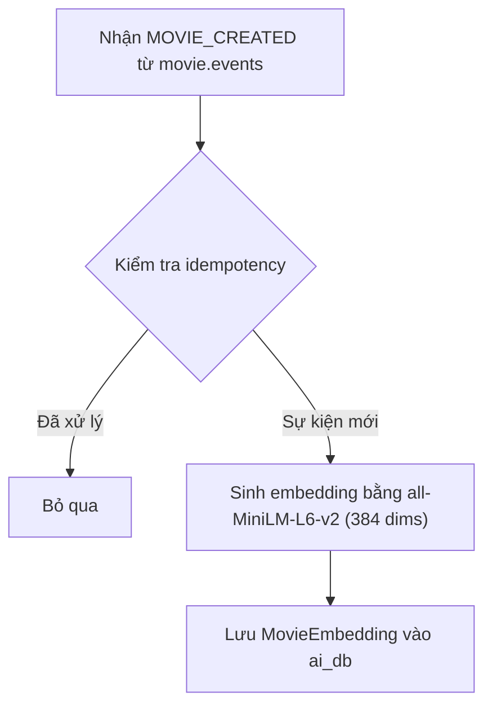

**AI Recommender Service — Lưu hành vi user (Kafka Consumer):**

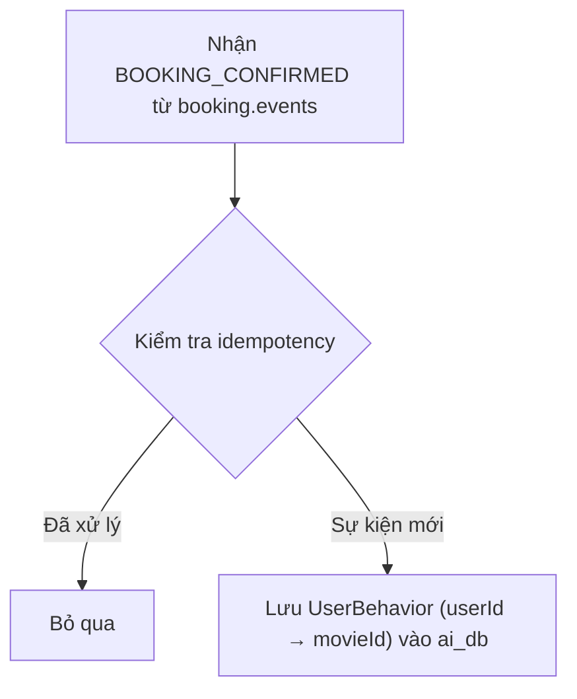

**AI Recommender Service — Gợi ý phim:**

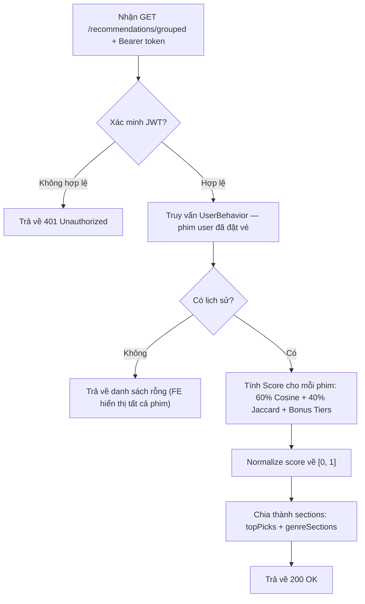

---

## Part 4 — Thiết kế luồng Saga

### 4.1 Lựa chọn mô hình Saga: Choreography (Biên đạo)

**Tại sao chọn Choreography (không phải Orchestration)?**
- Các dịch vụ tách rời lỏng — mỗi dịch vụ tự phản ứng với sự kiện độc lập
- Đơn giản hơn khi triển khai cho saga 3 dịch vụ
- Không có điểm lỗi đơn lẻ (không có orchestrator tập trung)
- Phù hợp tự nhiên với mô hình Outbox + CDC (Debezium)

### 4.2 Luồng THÀNH CÔNG — Trường hợp lý tưởng

```
┌──────────────┐    ┌──────────────┐    ┌──────────────┐    ┌────────────────┐    ┌────────────────┐
│   API Call    │───►│   BOOKING    │───►│    SEATS      │───►│    PAYMENT     │───►│    BOOKING     │
│ POST          │    │   CREATED    │    │   RESERVED    │    │   PROCESSED    │    │   CONFIRMED    │
│ /bookings     │    │              │    │               │    │                │    │                │
└──────────────┘    └──────────────┘    └──────────────┘    └────────────────┘    └────────────────┘
                          │                    │                     │                     │
                    Booking Service      Seat Service         Payment Service       Booking Service
                    tạo đơn đặt vé       giữ ghế              xử lý thanh toán     xác nhận đơn
                    + sự kiện outbox     + sự kiện outbox     + sự kiện outbox     + sự kiện outbox
```

**Chi tiết từng bước:**

| Bước | Dịch vụ | Lệnh | Sự kiện phát ra | Topic Kafka |
|------|---------|-------|-----------------|-------------|
| 1 | Booking Service | `CreateBooking` | `BOOKING_CREATED` | `booking.events` |
| 2 | Seat Service | `ReserveSeats` (phản ứng BOOKING_CREATED) | `SEATS_RESERVED` | `seat.events` |
| 3 | Payment Service | `ProcessPayment` (phản ứng SEATS_RESERVED) | `PAYMENT_PROCESSED` | `payment.events` |
| 4 | Booking Service | `ConfirmBooking` (phản ứng PAYMENT_PROCESSED) | `BOOKING_CONFIRMED` | `booking.events` |

### 4.3 Luồng THẤT BẠI — Bù trừ (Thanh toán thất bại)

```
┌──────────────┐    ┌──────────────┐    ┌──────────────┐    ┌────────────────┐
│   API Call    │───►│   BOOKING    │───►│    SEATS      │───►│    PAYMENT     │
│ POST          │    │   CREATED    │    │   RESERVED    │    │    FAILED      │
│ /bookings     │    │              │    │               │    │                │
└──────────────┘    └──────────────┘    └──────────────┘    └───────┬────────┘
                                                                    │
                          ┌─────────────────────────────────────────┘
                          │
                          ▼
                   ┌──────────────┐    ┌────────────────┐
                   │    SEATS      │───►│    BOOKING     │
                   │  COMPENSATED  │    │   CANCELLED    │
                   └──────────────┘    └────────────────┘
```

**Chi tiết luồng bù trừ:**

| Bước | Dịch vụ | Sự kiện nhận | Hành động | Sự kiện phát ra | Topic |
|------|---------|--------------|-----------|-----------------|-------|
| 1-3 | Giống luồng thành công | — | — | — | — |
| 4 | Payment Service | `SEATS_RESERVED` | Kiểm tra số dư user — không đủ tiền → thất bại | `PAYMENT_FAILED` | `payment.events` |
| 5 | Seat Service | `PAYMENT_FAILED` | Giải phóng ghế đã giữ → AVAILABLE | `SEATS_COMPENSATED` | `seat.events` |
| 6 | Booking Service | `SEATS_COMPENSATED` | Hủy đơn đặt vé → CANCELLED | `BOOKING_CANCELLED` | `booking.events` |

### 4.4 Luồng THẤT BẠI — Ghế không khả dụng

| Bước | Dịch vụ | Sự kiện nhận | Hành động | Sự kiện phát ra | Topic |
|------|---------|--------------|-----------|-----------------|-------|
| 1 | Booking Service | Gọi API | Tạo đơn đặt vé (PENDING) | `BOOKING_CREATED` | `booking.events` |
| 2 | Seat Service | `BOOKING_CREATED` | Ghế không khả dụng — thất bại | `SEAT_RESERVATION_FAILED` | `seat.events` |
| 3 | Booking Service | `SEAT_RESERVATION_FAILED` | Hủy đơn đặt vé → CANCELLED | `BOOKING_CANCELLED` | `booking.events` |

> Không cần bù trừ — không có công việc nào ở bước sau đã thực hiện.

---

## Part 5 — Kafka Topics & Định tuyến sự kiện

### 5.1 Định nghĩa Topic

| Topic | Nhà phát hành | Người đăng ký | Các sự kiện |
|-------|---------------|---------------|-------------|
| `booking.events` | Booking Service (qua Debezium CDC) | Seat Service, AI Recommender Service | `BOOKING_CREATED`, `BOOKING_CONFIRMED`, `BOOKING_CANCELLED` |
| `seat.events` | Seat Service (qua Debezium CDC) | Payment Service, Booking Service | `SEATS_RESERVED`, `SEAT_RESERVATION_FAILED`, `SEATS_COMPENSATED` |
| `payment.events` | Payment Service (qua Debezium CDC) | Booking Service, Seat Service | `PAYMENT_PROCESSED`, `PAYMENT_FAILED` |
| `movie.events` | Movie Service (qua Debezium CDC) | AI Recommender Service | `MOVIE_CREATED` |

### 5.2 Định nghĩa Payload sự kiện

**BOOKING_CREATED:**
```json
{
  "eventType": "BOOKING_CREATED",
  "aggregateId": "booking-uuid-123",
  "payload": {
    "bookingId": "booking-uuid-123",
    "userId": "user-001",
    "movieId": "movie-001",
    "showtimeId": "showtime-001",
    "seatIds": ["seat-A1", "seat-A2"],
    "totalAmount": 200000,
    "timestamp": "2026-04-07T10:30:00Z"
  }
}
```

**SEATS_RESERVED:**
```json
{
  "eventType": "SEATS_RESERVED",
  "aggregateId": "booking-uuid-123",
  "payload": {
    "bookingId": "booking-uuid-123",
    "userId": "user-001",
    "showtimeId": "showtime-001",
    "seatIds": ["seat-A1", "seat-A2"],
    "totalAmount": 200000,
    "timestamp": "2026-04-07T10:30:01Z"
  }
}
```

**PAYMENT_PROCESSED:**
```json
{
  "eventType": "PAYMENT_PROCESSED",
  "aggregateId": "booking-uuid-123",
  "payload": {
    "bookingId": "booking-uuid-123",
    "paymentId": "pay-uuid-456",
    "amount": 200000,
    "timestamp": "2026-04-07T10:30:02Z"
  }
}
```

**PAYMENT_FAILED:**
```json
{
  "eventType": "PAYMENT_FAILED",
  "aggregateId": "booking-uuid-123",
  "payload": {
    "bookingId": "booking-uuid-123",
    "showtimeId": "showtime-001",
    "seatIds": ["seat-A1", "seat-A2"],
    "reason": "Tài khoản không đủ số dư để thanh toán",
    "timestamp": "2026-04-07T10:30:02Z"
  }
}
```

**SEATS_COMPENSATED:**
```json
{
  "eventType": "SEATS_COMPENSATED",
  "aggregateId": "booking-uuid-123",
  "payload": {
    "bookingId": "booking-uuid-123",
    "showtimeId": "showtime-001",
    "seatIds": ["seat-A1", "seat-A2"],
    "reason": "Tài khoản không đủ số dư để thanh toán",
    "timestamp": "2026-04-07T10:30:03Z"
  }
}
```

**BOOKING_CONFIRMED / BOOKING_CANCELLED:**
```json
{
  "eventType": "BOOKING_CONFIRMED",
  "aggregateId": "booking-uuid-123",
  "payload": {
    "bookingId": "booking-uuid-123",
    "movieId": "movie-001",
    "showtimeId": "showtime-001",
    "seatIds": ["seat-A1", "seat-A2"],
    "status": "CONFIRMED",
    "timestamp": "2026-04-07T10:30:03Z"
  }
}
```

---

## Part 6 — Debezium + Outbox Pattern

### 6.1 Dịch vụ nào sử dụng Outbox

**Các dịch vụ phát sự kiện ra Kafka** đều sử dụng mô hình Outbox:

| Dịch vụ | Bảng outbox trong DB | Debezium Connector | Topic Kafka đích |
|---------|--------------------|--------------------|-------------------|
| Booking Service | `booking_db.outbox` | `outbox-connector` (duy nhất) | `booking.events` |
| Seat Service | `seat_db.outbox` | `outbox-connector` (duy nhất) | `seat.events` |
| Payment Service | `payment_db.outbox` | `outbox-connector` (duy nhất) | `payment.events` |
| Movie Service | `movie_db.outbox` | `outbox-connector` (duy nhất) | `movie.events` |

> Auth Service và AI Recommender Service không phát sự kiện qua outbox trong phiên bản hiện tại.

### 6.2 Cấu trúc bảng Outbox (giống nhau cho tất cả dịch vụ)

```sql
CREATE TABLE outbox (
    id VARCHAR(36) PRIMARY KEY,
  aggregate_type VARCHAR(255) NOT NULL,    -- 'booking', 'seat', 'payment', 'movie'
    aggregate_id VARCHAR(36) NOT NULL,       -- bookingId (ID tương quan)
    event_type VARCHAR(255) NOT NULL,        -- 'BOOKING_CREATED', v.v.
    payload JSON NOT NULL,                   -- dữ liệu sự kiện đầy đủ
    created_at TIMESTAMP(6) DEFAULT CURRENT_TIMESTAMP(6),
    processed BOOLEAN DEFAULT FALSE,
    INDEX idx_aggregate (aggregate_type, aggregate_id),
    INDEX idx_event_type (event_type),
    INDEX idx_created_at (created_at)
);
```

### 6.3 Cách sự kiện được phát ra

1. **Logic nghiệp vụ + ghi outbox** xảy ra trong **cùng một giao dịch cơ sở dữ liệu**
   - Ví dụ: Seat Service cập nhật trạng thái ghế VÀ chèn vào outbox trong một transaction
   - Điều này giải quyết **vấn đề dual-write** — không thể có tình trạng không nhất quán
2. **Debezium** giám sát bảng outbox qua MySQL binlog (CDC)
3. Debezium tự động phát các dòng outbox mới lên topic Kafka tương ứng
4. Định tuyến được cấu hình qua `transforms` của Debezium connector (EventRouter SMT), map theo `aggregate_type`:
  - `booking` -> `booking.events`
  - `seat` -> `seat.events`
  - `payment` -> `payment.events`
  - `movie` -> `movie.events`

### 6.4 Sơ đồ hoạt động

```
Dịch vụ ghi vào DB ──► [bảng outbox] ──► Debezium CDC ──► Topic Kafka
                              ↑                                    ↓
                     Cùng transaction               Các Consumer Service phản ứng
                     với dữ liệu nghiệp vụ
```

---

## Part 7 — Xử lý đồng thời & Điều kiện tranh chấp

### 7.1 Vấn đề đặt ghế trùng (Double-Booking)

**Vấn đề:** Hai khách hàng đồng thời cố gắng đặt cùng một ghế cho cùng một suất chiếu.

### 7.2 Giải pháp: Khóa bi quan (Pessimistic Locking — SELECT FOR UPDATE)

Seat Service sử dụng **khóa bi quan cấp dòng** khi giữ ghế:

```sql
-- Trong một transaction:
BEGIN;
SELECT * FROM seats WHERE showtime_id = ? AND id IN (?, ?) FOR UPDATE;
-- Kiểm tra tất cả ghế có trạng thái = 'AVAILABLE' không
-- Nếu có: UPDATE seats SET status = 'HELD' WHERE ...
-- Nếu không: yêu cầu thất bại với SEAT_RESERVATION_FAILED
COMMIT;
```

**Tại sao chọn cách này?**
- **Đơn giản và đáng tin cậy** cho kiến trúc mỗi-dịch-vụ-một-cơ-sở-dữ-liệu
- `SELECT FOR UPDATE` khóa cấp dòng, ngăn chặn sửa đổi đồng thời
- Nếu transaction khác cố gắng khóa cùng các dòng, nó sẽ chờ đến khi transaction đầu hoàn tất
- Có thể nâng cấp sử dụng Redis distributed lock

### 7.3 Tính Idempotent (Bất biến bịnh)

Mỗi dịch vụ theo dõi các sự kiện đã xử lý bằng bảng `processed_events`:

```sql
CREATE TABLE processed_events (
    id VARCHAR(36) PRIMARY KEY,
    event_id VARCHAR(36) NOT NULL UNIQUE,
    event_type VARCHAR(255) NOT NULL,
    processed_at TIMESTAMP DEFAULT CURRENT_TIMESTAMP,
    INDEX idx_event_id (event_id)
);
```

Trước khi xử lý bất kỳ sự kiện nào, dịch vụ kiểm tra:
1. Thử INSERT vào `processed_events` với event ID
2. Nếu INSERT thành công → xử lý sự kiện
3. Nếu INSERT thất bại (khóa trùng) → bỏ qua sự kiện (đã xử lý trước đó)

### 7.4 Các biện pháp bảo vệ bổ sung

- **TTL cho ghế HELD (cải tiến tương lai):** Ghế ở trạng thái HELD có thể hết hạn sau N phút nếu thanh toán chưa hoàn tất, tự động trở về AVAILABLE.
- **Kafka Consumer Groups:** Mỗi dịch vụ sử dụng nhóm consumer riêng, đảm bảo mỗi sự kiện được xử lý đúng một lần cho mỗi dịch vụ.
- **At-least-once delivery:** Kafka đảm bảo gửi ít nhất một lần. Kết hợp với idempotency, điều này đảm bảo ngữ nghĩa xử lý đúng một lần (exactly-once processing).

---

## Part 8 — Thiết kế cơ sở dữ liệu (Mỗi dịch vụ)

### 8.1 Booking Service Database (`booking_db`)

```sql
CREATE TABLE bookings (
    id VARCHAR(36) PRIMARY KEY,
    user_id VARCHAR(36) NOT NULL,
    movie_id VARCHAR(36) NOT NULL,
    showtime_id VARCHAR(36) NOT NULL,
    seat_ids JSON NOT NULL,              -- ["seat-A1", "seat-A2"]
    total_amount DECIMAL(10,2) NOT NULL,
    status ENUM('PENDING', 'SEATS_RESERVED', 'PAYMENT_PROCESSED', 'CONFIRMED', 'CANCELLED') DEFAULT 'PENDING',
    created_at TIMESTAMP DEFAULT CURRENT_TIMESTAMP,
    updated_at TIMESTAMP DEFAULT CURRENT_TIMESTAMP ON UPDATE CURRENT_TIMESTAMP,
    INDEX idx_user_id (user_id),
    INDEX idx_status (status),
    INDEX idx_created_at (created_at)
);

-- Bảng outbox (cùng cấu trúc với Phần 6.2)
-- Bảng processed_events (cùng cấu trúc với Phần 7.3)
```

### 8.2 Seat Service Database (`seat_db`)

```sql
CREATE TABLE seats (
    id VARCHAR(36) PRIMARY KEY,
    showtime_id VARCHAR(36) NOT NULL,
    seat_number VARCHAR(10) NOT NULL,      -- ví dụ: "A1", "B3"
    seat_row VARCHAR(5) NOT NULL,          -- ví dụ: "A", "B"
    status ENUM('AVAILABLE', 'HELD', 'BOOKED') DEFAULT 'AVAILABLE',
    booking_id VARCHAR(36) NULL,           -- đơn đặt vé nào đang giữ/đã đặt ghế này
    created_at TIMESTAMP DEFAULT CURRENT_TIMESTAMP,
    updated_at TIMESTAMP DEFAULT CURRENT_TIMESTAMP ON UPDATE CURRENT_TIMESTAMP,
    UNIQUE KEY uk_showtime_seat (showtime_id, seat_number),
    INDEX idx_showtime (showtime_id),
    INDEX idx_status (status)
);

-- Bảng outbox (cùng cấu trúc với Phần 6.2)
-- Bảng processed_events (cùng cấu trúc với Phần 7.3)
```

### 8.3 Auth Service Database (`auth_db`)

```sql
CREATE TABLE users (
    id VARCHAR(36) PRIMARY KEY,
    name VARCHAR(255) NOT NULL,
    email VARCHAR(255) NOT NULL UNIQUE,
    password_hash VARCHAR(255) NULL,
    role ENUM('USER', 'ADMIN') DEFAULT 'USER',
    created_at TIMESTAMP DEFAULT CURRENT_TIMESTAMP,
    updated_at TIMESTAMP DEFAULT CURRENT_TIMESTAMP ON UPDATE CURRENT_TIMESTAMP,
    INDEX idx_email (email)
);
```

### 8.4 Payment Service Database (`payment_db`)

```sql
CREATE TABLE wallets (
    user_id VARCHAR(36) PRIMARY KEY,
    balance DECIMAL(12,2) NOT NULL DEFAULT 0,   -- số dư tài khoản (VNĐ)
    created_at TIMESTAMP DEFAULT CURRENT_TIMESTAMP,
    updated_at TIMESTAMP DEFAULT CURRENT_TIMESTAMP ON UPDATE CURRENT_TIMESTAMP
);

CREATE TABLE payments (
    id VARCHAR(36) PRIMARY KEY,
    booking_id VARCHAR(36) NOT NULL,
    user_id VARCHAR(36) NOT NULL,
    amount DECIMAL(10,2) NOT NULL,
    status ENUM('PENDING', 'PROCESSED', 'FAILED', 'REFUNDED') DEFAULT 'PENDING',
    failure_reason VARCHAR(255) NULL,
    created_at TIMESTAMP DEFAULT CURRENT_TIMESTAMP,
    updated_at TIMESTAMP DEFAULT CURRENT_TIMESTAMP ON UPDATE CURRENT_TIMESTAMP,
    INDEX idx_booking_id (booking_id),
    INDEX idx_user_id (user_id),
    INDEX idx_status (status)
);

-- Bảng outbox (cùng cấu trúc với Phần 6.2)
-- Bảng processed_events (cùng cấu trúc với Phần 7.3)
```

> **Lưu ý:** Số dư user được seed sẵn trong database hoặc tạo qua API `POST /wallets` khi đăng ký. Khi thanh toán, Payment Service kiểm tra `wallets.balance >= totalAmount`. Nếu đủ → trừ số dư và ghi `PAYMENT_PROCESSED`. Nếu không đủ → ghi `PAYMENT_FAILED` và kích hoạt luồng bù trừ tự động.

### 8.5 Movie Service Database (`movie_db`)

```sql
CREATE TABLE movies (
    id VARCHAR(36) PRIMARY KEY,
    title VARCHAR(255) NOT NULL,
    genre VARCHAR(100),
    duration INT NOT NULL,             -- tính bằng phút
    poster_url VARCHAR(500),
    description TEXT,
    created_at TIMESTAMP DEFAULT CURRENT_TIMESTAMP,
    updated_at TIMESTAMP DEFAULT CURRENT_TIMESTAMP ON UPDATE CURRENT_TIMESTAMP
);

CREATE TABLE showtimes (
    id VARCHAR(36) PRIMARY KEY,
    movie_id VARCHAR(36) NOT NULL,
    hall VARCHAR(50) NOT NULL,           -- ví dụ: "Phòng A"
    start_time DATETIME NOT NULL,
    price DECIMAL(10,2) NOT NULL,
    created_at TIMESTAMP DEFAULT CURRENT_TIMESTAMP,
    updated_at TIMESTAMP DEFAULT CURRENT_TIMESTAMP ON UPDATE CURRENT_TIMESTAMP,
    FOREIGN KEY (movie_id) REFERENCES movies(id),
    INDEX idx_movie_id (movie_id),
    INDEX idx_start_time (start_time)
);
```

### 8.6 AI Recommender Service Database (`ai_db`)

```sql
-- Embeddings của mỗi phim (vector 384 chiều từ all-MiniLM-L6-v2)
CREATE TABLE movie_embeddings (
    movie_id VARCHAR(36) PRIMARY KEY,
    title VARCHAR(255) NOT NULL,
    genres JSON NOT NULL,                           -- ["Hành động", "Khoa học viễn tưởng"]
    embedding JSON NOT NULL,                        -- vector 384 dimensions
    updated_at TIMESTAMP DEFAULT CURRENT_TIMESTAMP ON UPDATE CURRENT_TIMESTAMP
);

-- Lịch sử phim user đã đặt vé (dùng để tính gợi ý)
CREATE TABLE user_behavior (
    id VARCHAR(36) PRIMARY KEY,
    user_id VARCHAR(36) NOT NULL,
    movie_id VARCHAR(36) NOT NULL,
    created_at TIMESTAMP DEFAULT CURRENT_TIMESTAMP,
    INDEX idx_user_id (user_id),
    INDEX idx_movie_id (movie_id),
    INDEX idx_user_movie (user_id, movie_id)
);

-- Bảng processed_events (cùng cấu trúc với Phần 7.3)
```

> **Lưu ý:** AI Recommender không sử dụng outbox (không phát sự kiện ra Kafka), chỉ tiêu thụ sự kiện và xử lý.

---

## Part 9 — Tổng kết các dịch vụ

| # | Dịch vụ | Bounded Context | Database | Cổng | Giao tiếp | Vai trò trong Saga |
|---|---------|-----------------|----------|------|-----------|---------------------|
| 1 | **Booking Service** | Đặt vé | `booking_db` | 5001 | REST + Kafka Consumer | Khởi tạo saga — tạo đơn, nhận sự kiện kết quả |
| 2 | **Seat Service** | Ghế ngồi | `seat_db` | 5002 | REST + Kafka Consumer | Giữ/giải phóng ghế — xử lý đồng thời + API đọc trạng thái ghế |
| 3 | **Movie Service** | Phim | `movie_db` | 5003 | REST + Event Publisher | API đọc phim/suất chiếu + Admin tạo phim (phát MOVIE_CREATED) |
| 4 | **Payment Service** | Thanh toán | `payment_db` | 5004 | REST + Kafka Consumer | Kiểm tra số dư ví, trừ tiền, API xem/tạo ví — kích hoạt bù trừ |
| 5 | **Auth Service** | Xác thực | `auth_db` | 5005 | Chỉ REST | Không tham gia saga — xác thực JWT, quản lý tài khoản |
| 6 | **AI Recommender Service** | Gợi ý AI | `ai_db` | 5006 | REST + Kafka Consumer | Không tham gia saga — gợi ý phim bằng AI (Cosine + Jaccard) |
| 7 | **API Gateway** | — | — | 8080 | HTTP Proxy | Định tuyến yêu cầu đến tất cả dịch vụ |
| 8 | **Frontend** | — | — | 3000 | HTTP Client | Giao diện duyệt phim, đặt vé, xem gợi ý AI |

---

## Các quyết định thiết kế chính & Giả định

1. **Choreography thay vì Orchestration** — Mỗi dịch vụ phản ứng với sự kiện độc lập, không có orchestrator tập trung.
2. **Thanh toán dựa trên số dư ví** — Payment Service kiểm tra số dư ví (wallet) trong DB. Nếu không đủ tiền → tự động `PAYMENT_FAILED` → compensation giải phóng ghế → hủy đơn.
3. **Số dư ví nạp sẵn trong DB** — Không cần chức năng nạp tiền, chỉ cần sửa trực tiếp số dư trong database để test.
4. **Auth tách riêng khỏi Payment** — Auth Service (đăng nhập/đăng ký/profile) được tách thành dịch vụ riêng (`auth_db`). Payment Service chỉ lo việc thanh toán và quản lý ví (`payment_db`). Đảm bảo Single Responsibility.
5. **Movie Service KHÔNG tham gia saga** — Là dịch vụ API đọc (kèm endpoint tạo phim cho ADMIN). Dữ liệu phim và suất chiếu được seed sẵn. Tách riêng giúp saga tập trung hơn.
6. **Ghế được mô hình hóa theo suất chiếu** — Mỗi suất chiếu có bộ ghế riêng, được seed khi khởi tạo.
7. **MySQL cho tất cả dịch vụ** — Debezium hỗ trợ CDC MySQL rất tốt qua binlog.
8. **`aggregateId` = `bookingId`** — Booking ID được dùng làm ID tương quan (correlation ID) xuyên suốt tất cả sự kiện trong saga.
9. **Seat Service có REST API** — Ngoài luồng saga (Kafka), Seat Service cung cấp `GET /seats?showtimeId=xxx` để frontend lấy trạng thái ghế thực tế (không hardcode).
10. **AI Recommender Service** — Dịch vụ gợi ý phim dựa trên AI, sử dụng mô hình all-MiniLM-L6-v2 để sinh semantic embeddings. Thuật toán: 60% Cosine Similarity + 40% Jaccard Similarity + bonus tiers. Tiêu thụ sự kiện MOVIE_CREATED và BOOKING_CONFIRMED từ Kafka. Không tham gia saga.
