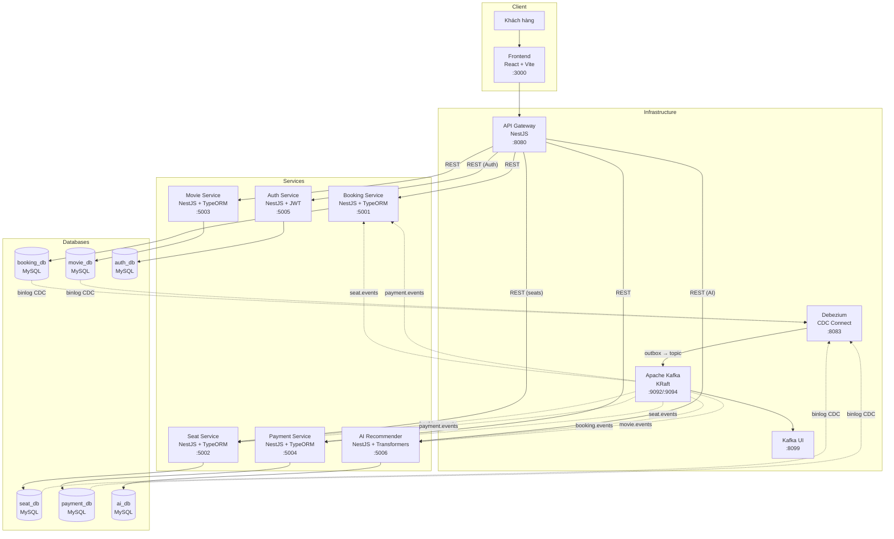
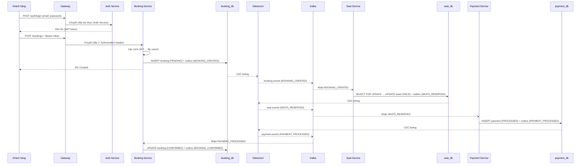
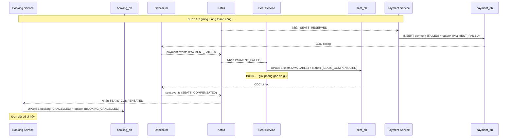
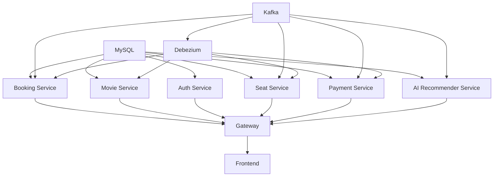

# System Architecture

> Tài liệu này được hoàn thành **sau** pha Analysis & Design.
> Cấu trúc tài liệu vẫn bám các mục bắt buộc của starter (`Pattern Selection` → `System Components` → `Communication` → `Architecture Diagram` → `Deployment`).

## 1. Pattern Selection

Chọn các mô hình kiến trúc dựa trên phân tích nghiệp vụ/kỹ thuật.

| Pattern | Selected? | Lý do nghiệp vụ/kỹ thuật |
|---------|-----------|---------------------------|
| API Gateway | ✅ Có | Điểm vào duy nhất cho frontend. Tập trung định tuyến, giảm tải phức tạp cho client. Frontend chỉ cần biết một URL duy nhất thay vì nhiều cổng dịch vụ. |
| Database per Service | ✅ Có | Mỗi dịch vụ sở hữu DB riêng (`booking_db`, `seat_db`, `movie_db`, `auth_db`, `payment_db`, `ai_db`). Đảm bảo cô lập dữ liệu, mở rộng độc lập, và tránh phụ thuộc chéo giữa các dịch vụ. |
| Shared Database | ❌ Không | Vi phạm nguyên tắc microservice. Gây coupling chặt giữa các dịch vụ, không thể scale độc lập. |
| Saga | ✅ Có | Cần thiết vì quy trình đặt vé trải qua 3 dịch vụ (Booking → Seat → Payment). Không thể dùng ACID transaction thông thường xuyên dịch vụ. Chọn **Choreography** — mỗi dịch vụ tự phản ứng với sự kiện, không có orchestrator tập trung, giảm coupling. |
| Event-driven / Message Queue | ✅ Có | Sử dụng **Apache Kafka** làm message broker. Giao tiếp bất đồng bộ giữa các dịch vụ saga. Kết hợp với Outbox + CDC để đảm bảo phát sự kiện đáng tin cậy (không bị mất sự kiện). |
| CQRS | ❌ Không | Hệ thống hiện tại chưa cần tách biệt đọc/ghi phức tạp. Có thể cân nhắc trong tương lai nếu cần tối ưu hiệu suất đọc. |
| Circuit Breaker | ❌ Không | Các dịch vụ giao tiếp qua Kafka (bất đồng bộ), không gọi HTTP trực tiếp giữa nhau. Kafka tự giữ tin nhắn nếu consumer ngừng. Không cần circuit breaker cho luồng saga. |
| Service Registry / Discovery | ❌ Không | Sử dụng Docker Compose DNS tĩnh. Các dịch vụ gọi nhau bằng tên container (ví dụ: `booking-service:5001`). Đủ cho môi trường phát triển và demo. |
| Outbox Pattern | ✅ Có | Giải quyết vấn đề **dual-write** — ghi dữ liệu nghiệp vụ và sự kiện trong cùng một transaction DB. Đảm bảo tính nhất quán giữa trạng thái DB và sự kiện Kafka. |
| CDC (Debezium) | ✅ Có | Đọc binlog MySQL để phát sự kiện từ bảng outbox lên Kafka tự động. Không cần code phát sự kiện thủ công. Đảm bảo gửi tin nhắn đáng tin cậy mà không cần polling. |
| Idempotent Consumer | ✅ Có | Kafka đảm bảo at-least-once delivery. Cần idempotency để tránh xử lý trùng. Mỗi dịch vụ lưu `processed_events` để kiểm tra sự kiện đã xử lý chưa. |
| Pessimistic Locking | ✅ Có | Giải quyết vấn đề **đặt ghế trùng** (double-booking). Dùng `SELECT FOR UPDATE` khóa cấp dòng khi giữ ghế, ngăn 2 booking đồng thời giữ cùng ghế. |
| JWT Authentication | ✅ Có | Xác thực stateless bằng **JSON Web Token**. **Auth Service** phát hành token khi đăng nhập, các dịch vụ khác xác minh token bằng shared secret. userId trích xuất từ JWT payload, không tin tưởng từ client. Mật khẩu hash bằng **bcrypt** (10 rounds). |

> Lý thuyết nền tảng: *Microservices Patterns* — Chris Richardson, các chương về phân rã, quản lý dữ liệu, và mô hình giao tiếp.

---

## 2. System Components

| Thành phần | Trách nhiệm | Công nghệ | Cổng |
|-----------|-------------|------------|------|
| **Frontend** | Giao diện cho khách hàng duyệt phim, chọn ghế, đặt vé, xem gợi ý AI | React + Vite | 3000 |
| **Gateway** | Điểm vào duy nhất, định tuyến HTTP đến các dịch vụ | NestJS (HTTP Proxy) | 8080 |
| **Booking Service** | Quản lý vòng đời đặt vé, khởi tạo saga, tiêu thụ sự kiện kết quả từ Kafka | NestJS + TypeORM + Kafka | 5001 |
| **Seat Service** | Quản lý kho ghế theo suất chiếu, giữ/giải phóng ghế, cung cấp API đọc trạng thái ghế | NestJS + TypeORM + Kafka | 5002 |
| **Movie Service** | Quản lý danh mục phim và suất chiếu (API đọc + Admin tạo phim), phát sự kiện MOVIE_CREATED | NestJS + TypeORM | 5003 |
| **Payment Service** | Xử lý thanh toán dựa trên số dư ví (wallet), API xem số dư và tạo ví | NestJS + TypeORM + Kafka | 5004 |
| **Auth Service** | Xác thực JWT (đăng nhập/đăng ký/profile), quản lý tài khoản người dùng | NestJS + TypeORM + JWT | 5005 |
| **AI Recommender Service** | Gợi ý phim dựa trên AI (60% Cosine Similarity + 40% Jaccard Similarity + bonus tiers). Sử dụng mô hình all-MiniLM-L6-v2 | NestJS + TypeORM + Kafka + Transformers | 5006 |
| **MySQL** | 6 cơ sở dữ liệu riêng biệt — mỗi dịch vụ một DB | MySQL 8.0 | 3306 |
| **Kafka** | Message broker hướng sự kiện, trung gian giữa các dịch vụ saga + AI | Apache Kafka 3.7 (KRaft) | 9092 (nội bộ) / 9094 (bên ngoài) |
| **Kafka UI** | Giao diện web để giám sát topic, consumer group, tin nhắn Kafka | Provectus Kafka UI | 8099 |
| **Debezium** | CDC — bắt thay đổi từ bảng outbox trong MySQL và đẩy lên Kafka | Debezium Connect 2.5 | 8083 |

---

## 3. Communication

### Ma trận giao tiếp giữa các dịch vụ

| Từ → Đến | Booking Service | Seat Service | Movie Service | Payment Service | Auth Service | AI Recommender | Kafka | Database |
|-----------|-----------------|--------------|---------------|-----------------|--------------|----------------|-------|----------|
| **Frontend** | — | — | — | — | — | — | — | — |
| **Gateway** | HTTP (REST) | HTTP (REST: seats) | HTTP (REST) | HTTP (REST: wallets/me) | HTTP (REST: Auth) | HTTP (REST: recommendations) | — | — |
| **Booking Service** | — | — | — | — | — | — | Phát: `booking.events` / Nhận: `seat.events`, `payment.events` | `booking_db` |
| **Seat Service** | — | — | — | — | — | — | Phát: `seat.events` / Nhận: `booking.events`, `payment.events` | `seat_db` |
| **Movie Service** | — | — | — | — | — | — | Phát: `movie.events` | `movie_db` |
| **Auth Service** | — | — | — | HTTP (internal) | — | — | — | `auth_db` |
| **Payment Service** | — | — | — | — | — | — | Phát: `payment.events` / Nhận: `seat.events` | `payment_db` |
| **AI Recommender** | — | — | HTTP (fetch movies) | — | — | — | Nhận: `movie.events`, `booking.events` | `ai_db` |
| **Debezium** | — | — | — | — | — | — | Phát sự kiện CDC | Đọc binlog từ các DB có outbox publisher (`booking_db`, `seat_db`, `payment_db`, `movie_db`) |

### Chi tiết giao tiếp

**Đồng bộ (Synchronous — HTTP REST):**
- Frontend → Gateway → Booking Service (tạo/xem đơn đặt vé) — yêu cầu JWT
- Frontend → Gateway → Movie Service (duyệt phim, suất chiếu, Admin tạo phim) — public/ADMIN
- Frontend → Gateway → Auth Service (đăng nhập/đăng ký/profile) — auth endpoints
- Frontend → Gateway → Seat Service (xem trạng thái ghế theo suất chiếu) — public
- Frontend → Gateway → Payment Service (xem số dư ví) — yêu cầu JWT
- Frontend → Gateway → AI Recommender Service (gợi ý phim theo sections) — yêu cầu JWT
- Auth Service → Payment Service (tạo ví khi đăng ký user mới) — internal HTTP
- AI Recommender Service → Movie Service (fetch danh sách phim khi seed embeddings) — internal HTTP

**Bất đồng bộ (Asynchronous — Kafka Events):**
- Booking Service → (outbox → Debezium CDC) → Kafka `booking.events` → Seat Service, AI Recommender Service
- Seat Service → (outbox → Debezium CDC) → Kafka `seat.events` → Payment Service, Booking Service
- Payment Service → (outbox → Debezium CDC) → Kafka `payment.events` → Booking Service, Seat Service
- Movie Service → (outbox → Debezium CDC) → Kafka `movie.events` → AI Recommender Service

> **Quan trọng:** Các dịch vụ saga KHÔNG gọi HTTP trực tiếp lẫn nhau. Tất cả giao tiếp giữa Booking, Seat, Payment đều qua Kafka events. Ngoại lệ: Auth Service gọi Payment Service khi đăng ký để tạo ví; AI Recommender Service gọi Movie Service khi khởi động để seed embeddings.

---

## 4. Architecture Diagram

> Đặt sơ đồ vào `docs/asset/` và tham chiếu tại đây.

### 4.1 Sơ đồ tổng quan hệ thống



### 4.2 Sơ đồ luồng Saga — Đặt vé thành công



### 4.3 Sơ đồ luồng Saga — Thanh toán thất bại (Bù trừ)



---

## 5. Deployment

- Tất cả dịch vụ được đóng gói bằng Docker container
- Điều phối qua Docker Compose
- Khởi động bằng một lệnh duy nhất: `docker compose up --build`

### Cấu trúc Docker Compose

```yaml
services:
  # --- Hạ tầng ---
  mysql:          # MySQL 8 — 6 database riêng biệt
  kafka:          # Apache Kafka 3.7 (KRaft — không cần Zookeeper)
  kafka-ui:       # Giao diện web giám sát Kafka
  debezium:       # Debezium Connect — 1 connector (outbox-connector)

  # --- Dịch vụ ứng dụng ---
  frontend:       # React + Vite
  gateway:        # API Gateway NestJS
  booking-service: # Booking Service NestJS
  seat-service:   # Seat Service NestJS
  movie-service:  # Movie Service NestJS
  payment-service: # Payment Service NestJS
  auth-service:   # Auth Service NestJS
  ai-recommender-service: # AI Recommender Service NestJS + Transformers
```

### Thứ tự khởi động (phụ thuộc)



### Biến môi trường chính

| Biến | Mô tả | Giá trị mặc định |
|------|--------|-------------------|
| `DB_HOST` | Hostname của MySQL | `mysql` |
| `DB_PORT` | Cổng MySQL | `3306` |
| `DB_USERNAME` | Tên đăng nhập MySQL | `root` |
| `DB_PASSWORD` | Mật khẩu MySQL | `123456` |
| `KAFKA_BROKER` | Địa chỉ Kafka broker | `kafka:9092` (trong Docker) |
| `DEBEZIUM_HOST` | Địa chỉ Debezium Connect | `debezium:8083` |
| `BOOKING_SERVICE_PORT` | Cổng Booking Service | `5001` |
| `SEAT_SERVICE_PORT` | Cổng Seat Service | `5002` |
| `MOVIE_SERVICE_PORT` | Cổng Movie Service | `5003` |
| `PAYMENT_SERVICE_PORT` | Cổng Payment Service | `5004` |
| `AUTH_SERVICE_PORT` | Cổng Auth Service | `5005` |
| `JWT_SECRET` | Khóa bí mật ký JWT token | `movie-booking-jwt-secret-key-2026` |
| `AUTH_SERVICE_URL` | URL Auth Service (dùng cho Gateway) | `http://auth-service:5005` |
| `SEAT_SERVICE_URL` | URL Seat Service (dùng cho Gateway) | `http://seat-service:5002` |
| `PAYMENT_SERVICE_URL` | URL Payment Service (dùng cho Gateway + Auth) | `http://payment-service:5004` |
| `AI_RECOMMENDER_SERVICE_PORT` | Cổng AI Recommender Service | `5006` |
| `AI_RECOMMENDER_SERVICE_URL` | URL AI Recommender Service (dùng cho Gateway) | `http://ai-recommender-service:5006` |
| `MOVIE_SERVICE_URL` | URL Movie Service (dùng cho AI Recommender) | `http://movie-service:5003` |

---

## 6. Cấu trúc thư mục dự án

```
movie-ticket-booking-system/
├── README.md
├── GETTING_STARTED.md
├── docker-compose.yml
├── .env.docker.example
├── .env.local.example
├── Makefile
│
├── docs/
│   ├── analysis-and-design-ddd.md
│   ├── architecture.md                 ← (tài liệu này)
│   ├── asset/
│   └── api-specs/
│       ├── booking-service.yaml
│       ├── movie-service.yaml
│       ├── seat-service.yaml
│       ├── payment-service.yaml
│       ├── auth-service.yaml
│       └── ai-recommender-service.yaml
│
├── frontend/                            ← React + Vite (clean code modules)
│   ├── Dockerfile
│   ├── readme.md
│   └── src/
│       ├── main.jsx                    ← Entry point
│       ├── App.jsx                     ← Orchestrator (routing + state)
│       ├── index.css                   ← Global styles
│       ├── utils/
│       │   ├── api.js                  ← API fetch, auth token helpers
│       │   └── format.js               ← VND, date/time formatting
│       ├── constants/
│       │   └── status.js               ← STATUS_MAP (booking statuses)
│       ├── components/
│       │   ├── Header.jsx              ← Header (nav, wallet, user info)
│       │   └── Toast.jsx               ← Toast notifications
│       └── pages/
│           ├── LoginPage.jsx           ← Đăng nhập / Đăng ký
│           ├── MovieListPage.jsx       ← Danh sách phim
│           ├── CreateMoviePage.jsx     ← Tạo phim mới (ADMIN)
│           ├── RecommendationsPage.jsx ← Gợi ý phim AI
│           ├── BookingPage.jsx         ← Chọn suất chiếu + ghế
│           ├── BookingDetailPage.jsx   ← Chi tiết đơn + saga progress
│           └── BookingsPage.jsx        ← Lịch sử đơn đặt vé
│
├── gateway/                             ← API Gateway NestJS
│   ├── Dockerfile
│   ├── readme.md
│   └── src/
│
├── services/
│   ├── booking-service/                 ← Booking Service NestJS
│   │   ├── Dockerfile
│   │   ├── readme.md
│   │   └── src/
│   │       ├── main.ts
│   │       ├── app.module.ts
│   │       ├── booking.module.ts
│   │       ├── controllers/
│   │       ├── services/
│   │       ├── consumers/               ← Kafka Consumer
│   │       └── entities/
│   │
│   ├── seat-service/                    ← Seat Service NestJS
│   │   ├── Dockerfile
│   │   ├── readme.md
│   │   └── src/
│   │       ├── main.ts
│   │       ├── app.module.ts
│   │       ├── seat.module.ts
│   │       ├── consumers/
│   │       ├── services/
│   │       └── entities/
│   │
│   ├── movie-service/                   ← Movie Service NestJS
│   │   ├── Dockerfile
│   │   ├── readme.md
│   │   └── src/
│   │       ├── main.ts
│   │       ├── app.module.ts
│   │       ├── movie.module.ts
│   │       ├── controllers/
│   │       ├── services/
│   │       └── entities/
│   │
│   ├── payment-service/                 ← Payment Service NestJS
│   │   ├── Dockerfile
│   │   ├── readme.md
│   │   └── src/
│   │       ├── main.ts
│   │       ├── app.module.ts
│   │       ├── payment.module.ts
│   │       ├── consumers/
│   │       ├── services/
│   │       └── entities/
│   │           ├── wallet.entity.ts     ← Ví tài khoản (user_id + balance)
│   │           └── payment.entity.ts
│   │
│   ├── auth-service/                    ← Auth Service NestJS
│   │   ├── Dockerfile
│   │   ├── readme.md
│   │   └── src/
│   │       ├── main.ts
│   │       ├── app.module.ts
│   │       ├── auth.module.ts
│   │       ├── controllers/
│   │       │   └── auth.controller.ts
│   │       ├── services/
│   │       │   └── auth.service.ts
│   │       └── entities/
│   │           └── user.entity.ts       ← Tài khoản user (email + password)
│   │
│   └── ai-recommender-service/          ← AI Recommender Service NestJS
│       ├── Dockerfile
│       ├── readme.md
│       └── src/
│           ├── main.ts
│           ├── app.module.ts
│           ├── recommender.module.ts
│           ├── controllers/
│           │   └── recommender.controller.ts
│           ├── services/
│           │   ├── recommender.service.ts  ← 60% Cosine + 40% Jaccard + bonus tiers
│           │   └── embedding.service.ts   ← all-MiniLM-L6-v2 embedding model
│           ├── consumers/
│           │   └── recommender.consumer.ts ← MOVIE_CREATED + BOOKING_CONFIRMED
│           └── entities/
│               ├── movie-embedding.entity.ts  ← Vector embeddings (384 dims)
│               └── user-behavior.entity.ts    ← Lịch sử phim user đã đặt vé
│
├── libs/
│   └── common/                          ← Thư viện chia sẻ
│       └── src/
│           ├── index.ts
│           ├── auth/
│           │   └── jwt-auth.guard.ts    ← Shared JWT Guard
│           ├── types/
│           │   └── bcryptjs.d.ts        ← Type declarations
│           ├── entities/
│           │   ├── outbox.entity.ts
│           │   └── processed-event.entity.ts
│           ├── events/
│           │   └── event-types.ts
│           └── outbox/
│               ├── outbox.service.ts
│               ├── outbox.module.ts
│               ├── idempotency.service.ts
│               └── debezium-connector.service.ts
│
├── scripts/
│   └── init-db.sql                      ← Khởi tạo 6 database + seed data
│
└── .ai/
    ├── AGENTS.md
    └── prompts/
```

---

## 7. Debezium Connector — Cấu hình chi tiết

Hệ thống sử dụng **một connector duy nhất** giám sát bảng outbox của 4 database có publisher (booking, seat, payment, movie):

```json
{
  "name": "outbox-connector",
  "config": {
    "connector.class": "io.debezium.connector.mysql.MySqlConnector",
    "tasks.max": "1",
    "database.hostname": "mysql",
    "database.port": "3306",
    "database.user": "root",
    "database.password": "123456",
    "database.server.id": "1",
    "topic.prefix": "saga",
    "database.include.list": "booking_db,seat_db,payment_db,movie_db",
    "table.include.list": "booking_db.outbox,seat_db.outbox,payment_db.outbox,movie_db.outbox",

    "transforms": "outbox",
    "transforms.outbox.type": "io.debezium.transforms.outbox.EventRouter",
    "transforms.outbox.table.expand.json.payload": "true",
    "transforms.outbox.table.field.event.id": "id",
    "transforms.outbox.table.field.event.key": "aggregate_id",
    "transforms.outbox.table.field.event.type": "event_type",
    "transforms.outbox.table.field.event.payload": "payload",
    "transforms.outbox.route.by.field": "aggregate_type",
    "transforms.outbox.route.topic.replacement": "${routedByValue}.events"
  }
}
```

**Cách hoạt động EventRouter:**
- Debezium đọc dòng mới từ bảng `outbox`
- Trường `aggregate_type` quyết định topic đích:
  - `aggregate_type = 'booking'` → topic `booking.events`
  - `aggregate_type = 'seat'` → topic `seat.events`
  - `aggregate_type = 'payment'` → topic `payment.events`
  - `aggregate_type = 'movie'` → topic `movie.events`
- Trường `aggregate_id` được dùng làm message key (đảm bảo thứ tự cho cùng booking)
- Trường `payload` chứa nội dung sự kiện dưới dạng JSON
