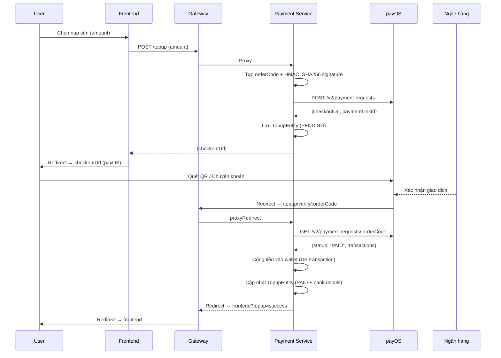

# Payment Service

> Dịch vụ xử lý thanh toán — kiểm tra số dư ví, trừ tiền, và **nạp tiền ví qua payOS**

## Vai trò trong Saga

- **Xử lý thanh toán**: Nhận `SEATS_RESERVED` → Kiểm tra số dư ví (wallet):
  - `balance >= totalAmount` → Trừ tiền → phát `PAYMENT_PROCESSED`
  - `balance < totalAmount` → phát `PAYMENT_FAILED` (kích hoạt compensation)

> ⚠️ **Auth đã chuyển sang auth-service (port 5005)** — Payment service không còn xử lý đăng nhập/đăng ký.

## Nạp tiền ví — payOS Integration

Payment Service tích hợp **payOS** cho phép user nạp tiền vào ví qua chuyển khoản ngân hàng / QR code.

### Luồng nạp tiền



### payOS Keys cần thiết

| Key | ENV Variable | Mô tả |
|-----|-------------|-------|
| **Client ID** | `PAYOS_CLIENT_ID` | Định danh kênh thanh toán, header `x-client-id` |
| **API Key** | `PAYOS_API_KEY` | Xác thực API, header `x-api-key` |
| **Checksum Key** | `PAYOS_CHECKSUM_KEY` | Tạo HMAC_SHA256 signature đảm bảo tính toàn vẹn dữ liệu |

> Lấy tại: https://my.payos.vn → Kênh thanh toán → Thông tin

### Cơ chế Signature

```
data = "amount=${amount}&cancelUrl=${cancelUrl}&description=${description}&orderCode=${orderCode}&returnUrl=${returnUrl}"
signature = HMAC_SHA256(checksumKey, data)
```

Các trường được sắp xếp theo thứ tự alphabet.

## API Endpoints

### Wallet

| Endpoint | Method | Auth | Mô tả |
|----------|--------|------|-------|
| `/health` | GET | ❌ | Kiểm tra sức khỏe |
| `/wallets/me` | GET | ✅ | Xem số dư ví của user hiện tại |
| `/wallets` | POST | ❌ | Tạo ví cho user mới (gọi nội bộ bởi Auth Service) |

### Nạp tiền (Top-up via payOS)

| Endpoint | Method | Auth | Mô tả |
|----------|--------|------|-------|
| `/topup` | POST | ✅ JWT | Tạo link nạp tiền → trả checkoutUrl |
| `/topup/verify/:orderCode` | GET | ❌ Public | payOS redirect → verify + redirect frontend |
| `/topup/webhook` | POST | ❌ Public | Webhook nhận thông tin thanh toán real-time |
| `/topup/history` | GET | ✅ JWT | Lấy lịch sử nạp tiền của user |
| `/topup/:orderCode` | DELETE | ✅ JWT | Huỷ giao dịch nạp tiền đang pending |

> Payment Service còn hoạt động theo hướng sự kiện: nhận `SEATS_RESERVED` từ Kafka, xử lý thanh toán và phát `PAYMENT_PROCESSED` hoặc `PAYMENT_FAILED`.

## Kiến trúc số dư

- **wallets** table: lưu số dư tài khoản theo `user_id`
- **topups** table: lưu lịch sử nạp tiền với chi tiết giao dịch payOS
- Số dư được seed sẵn trong database
- Auth-related data (name, email, password) nằm trong `auth-service` (auth_db)

### Bảng topups — Dữ liệu lưu từ payOS

| Column | Nguồn payOS | Mô tả |
|--------|-------------|-------|
| `order_code` | `orderCode` | Mã đơn hàng (9 chữ số random) |
| `amount` | `amount` | Số tiền nạp |
| `status` | `status` | PENDING / PAID / CANCELLED / EXPIRED / FAILED |
| `checkout_url` | `checkoutUrl` | Link thanh toán payOS |
| `payment_link_id` | `paymentLinkId` | Mã link thanh toán |
| `transaction_reference` | `transactions[0].reference` | Mã tham chiếu giao dịch ngân hàng |
| `counter_account_bank_name` | `counterAccountBankName` | Tên ngân hàng khách hàng |
| `counter_account_name` | `counterAccountName` | Tên tài khoản khách hàng |
| `counter_account_number` | `counterAccountNumber` | Số tài khoản khách hàng |
| `paid_at` | `transactionDateTime` | Thời gian giao dịch thành công |

### Seed Wallets
| User ID | Số dư | Ghi chú |
|---------|-------|---------|
| user-001 | 500,000 ₫ | Đủ 3-4 vé |
| user-002 | 50,000 ₫ | Test PAYMENT_FAILED |
| user-005 | 3,000,000 ₫ | VIP |

## Tech Stack

- **Runtime**: NestJS + TypeORM
- **Database**: MySQL (`payment_db`)
- **Messaging**: Kafka Consumer (seat.events)
- **Payment Gateway**: payOS (HMAC_SHA256 + REST API)
- **Port**: 5004

## Cấu trúc

```
src/
├── main.ts
├── app.module.ts
├── payment.module.ts
├── entities/
│   ├── wallet.entity.ts       # Ví tài khoản (user_id + balance)
│   ├── payment.entity.ts      # Bản ghi thanh toán (booking)
│   └── topup.entity.ts        # Bản ghi nạp tiền (payOS)
├── controllers/
│   ├── payment.controller.ts  # Health + Wallet REST API
│   └── topup.controller.ts    # Nạp tiền payOS REST API
├── services/
│   ├── payment.service.ts     # Balance check + deduction
│   └── topup.service.ts       # payOS integration logic
└── consumers/
    └── payment.consumer.ts    # Kafka event consumer
```
